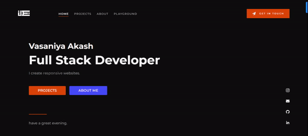

<h1 align="center">Welcome to developer-portfolio 👋</h1>

### Description

A simple portfolio template for developer/designers built with React. 

### Screenshot

## Technologies Used

- [reactstrap](https://reactstrap.github.io/)
- [react-reveal](https://www.react-reveal.com/)
- [react-lottie](https://www.npmjs.com/package/react-lottie)
- [react-headroom](https://github.com/KyleAMathews/react-headroom)
- [color-thief](https://github.com/lokesh/color-thief)

## Icons

-react-icons are used in skill section. You can find all the icons here: [react-icons](https://react-icons.github.io/react-icons/).

### Features

- Fully Responsive
- Multi-Page Layout
- Contact Form With EmailJs
- React-Bootstrap
- Edit Content From One Place
  
### Setup

Install required dependencies

<pre>yarn install</pre>

Start the server

<pre>yarn start</pre>

**Note: this is a one-way operation. Once you `eject`, you can't go back!**

If you aren't satisfied with the build tool and configuration choices, you can `eject` at any time. This command will remove the single build dependency from your project.

Instead, it will copy all the configuration files and the transitive dependencies (webpack, Babel, ESLint, etc) right into your project so you have full control over them. All of the commands except `eject` will still work, but they will point to the copied scripts so you can tweak them. At this point you're on your own.

You don't have to ever use `eject`. The curated feature set is suitable for small and middle deployments, and you shouldn't feel obligated to use this feature. However we understand that this tool wouldn't be useful if you couldn't customize it when you are ready for it.

### Thanks

If you like this portfolio template don't forget give it a ⭐ 

